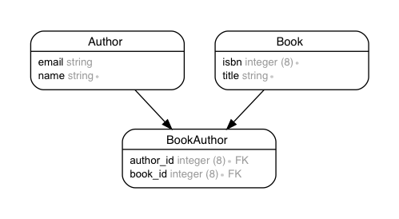

This sample app shows how to use
[fruwe/csv_step_importer](https://github.com/fruwe/csv_step_importer)
:gem:
to import data from a single CSV file
[spec/fixtures/files/books.csv](spec/fixtures/files/books.csv)
into several DB tables, say `Author`, `Book` and `BookAuthor`.

